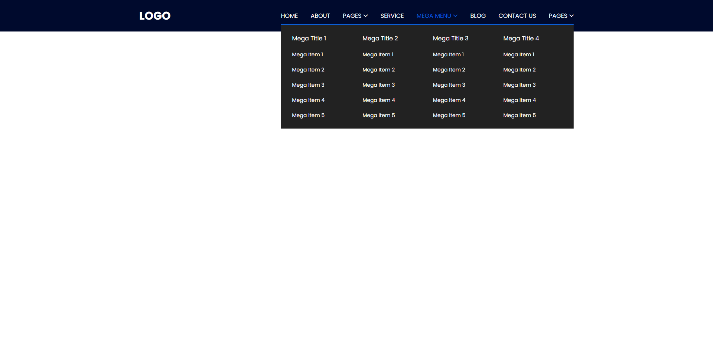
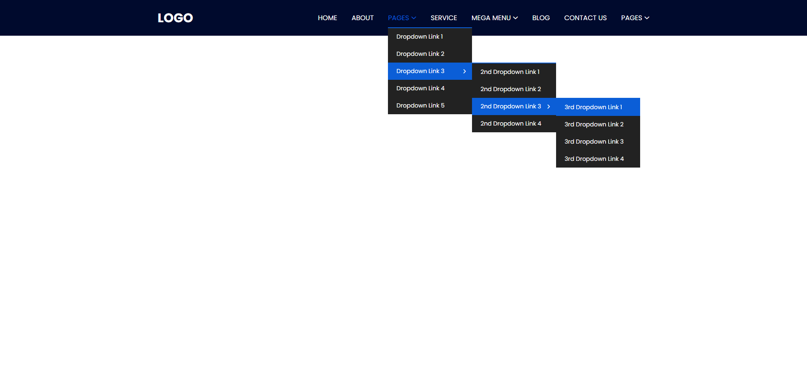
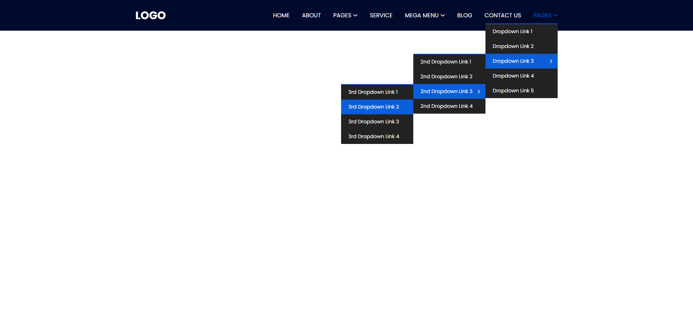

# Hero Slider

[Tutorial Link](https://www.google.com)

# Lib

https://github.com/meanthemes/meanMenu

https://github.com/onokumus/metismenu

https://github.com/davist11/jQuery-One-Page-Nav

```js
$('.main-menu nav > ul > li').slice(-4).addClass('menu-last');
```




